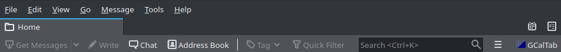

<p align="center"></p>
# GCalTab 
GCalTab is a Thunderbird add-on that opens Google Calendar website in a Thunderbird tab.
It features a beautiful dark mode thanks to the [DarkReader](https://darkreader.org/) algorithm.  

******************
<p align="center">
    <strong>Get it from<br>
    <a href="addons.thunderbird.net">addons.thunderbird.net</a>
    </strong>
</p>

******************

## How does it work ?
Once the add-on is installed, a new icon appears in Thunderbird Mail toolbar:


Click on it to see GCalTab menu:  
<p align="center"></p>

Click on "Open" to open the Google Calendar tab. You can switch on/off the "Dark" button to activate DarkReader on the Google Calendar tab.

### What permissions are needed ?
GCalTab will need to access your data for:  
* accounts.google.com  
* calendar.google.com  
* google.com  

### Does it means that GCalTab collects my data ?
No, GCalTab simply opens tabs in Thunderbird, exactly as it would be done in a web browser.  
It does not collect any data.  
These permissions are needed to allow GCalTab to "manage" tabs for these three domains in Thunderbird. "Manage" means:
* opening tabs
* execute scripts on these tabs

Tabs are open for obvious reason: that's the aim of the add-on.  
The only script that can be executed on these tabs is the [DarkReader](https://darkreader.org/) algorithm, that has a strict [privacy policy](https://darkreader.org/privacy/).  

Of course, Google Calendar works as it would do in your web browser, including regarding data collection.

### So GCalTab will never transmit my data to anyone ?
Never.

### How do I stay connected when I re-open Thunderbird ?
If you wish to stay connected to Google Calendar, you will have to allow cookies.  
The cookies menu can be access as follow in Thunderbird:    
_GNU/Linux_ : "Edit" > "Preferences" > "Privacy" or "Privacy and Security" > "Web Content" section.  
_macOS_ : "Thunderbird" > "Preferences" > "Privacy" or "Privacy and Security" > "Web Content" section.  
_Windows_ : "Tools" > "Options" > "Privacy" or "Privacy and Security" > "Web Content" section.  
You will have to allow and keep cookies for these three domains:
* accounts.google.com
* calendar.google.com
* google.com

### How do I disconnect from a Google Calendar account ?
If you use the "Sign out" button, the link will open in your web browser and will not disconnect Thunderbird.  
In order to properly disconnect Thunderbird from Google Calendar, you need to delete three cookies.  
_GNU/Linux_ : "Edit" > "Preferences" > "Privacy" or "Privacy and Security" > "Web Content" section.  
_macOS_ : "Thunderbird" > "Preferences" > "Privacy" or "Privacy and Security" > "Web Content" section.  
_Windows_ : "Tools" > "Options" > "Privacy" or "Privacy and Security" > "Web Content" section.  
Delete the cookies for these three domains:
* accounts.google.com
* calendar.google.com
* google.com

## Build from source
Prerequisite:  
Install [web-ext](https://extensionworkshop.com/documentation/develop/getting-started-with-web-ext/).  

The add-on can be built by running the following command from its root directory:  
```
web-ext build
```

More specifically, if you have cloned this repository, you can run:
```
web-ext build --ignore-files=images README.md
```

## Legal notice
Thunderbird is a registered trademark of the Mozilla Foundation.  
Google is a registered trademark of Google LLC.  
GNU is a registered trademark of the Free Software Foundation.  
Linux is a registered trademark of Linus Torvalds.  
Windows is a registered trademark of Microsoft Corporation.  
macOS is a registered trademark of Apple Inc.  

The above-mentioned trademarks are only used to refer to products.  
GCalTab and its developer are not affiliated, sponsored nor endorsed by any of the above-mentioned organizations.

## Acknowledgments
GCalTab is styled with [Spectre.css](https://picturepan2.github.io/spectre/)